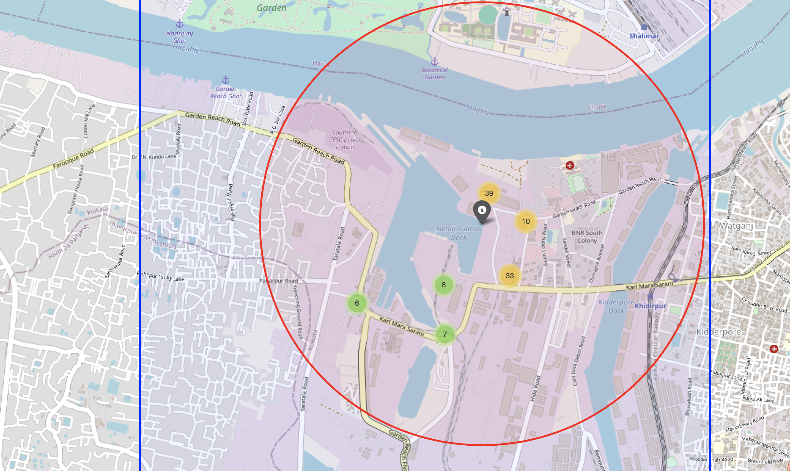
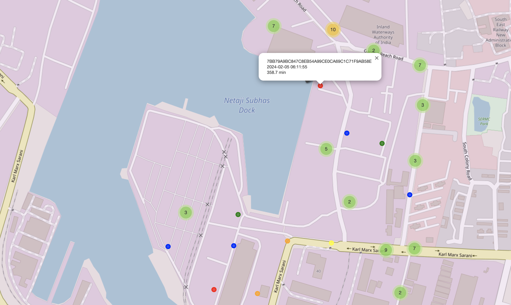

<div align="center">
<h1>Big Data and AI logistics model for First-Last Mile Issues in India </h1>
</div>

A comprehensive Python framework for analyzing GPS truck trajectory data.

## Table of Contents
- [Project Overview](#project-overview)
- [Project Structure](#project-structure)
- [Installation](#installation)
- [Data Format](#data-format)
- [Data Preprocessing](#data-preprocessing)
- [Methods](#methods)
   - [State Classification](#state-classification)
   - [Substate Classification](#substate-classification)
   - [Prediction Model](#prediction-model)
- [Case Study](#case-study)

## Project Overview

This project provides a complete pipeline for GPS vehicle trajectory analysis, including:

- **Data Preprocessing**: GPS data cleaning, POI matching, and trajectory filtering
- **State Classification**: Rule-based truck state classification (idling, on-the-move, stopping)
- **Substate Classification**: Logistics-related state detection combined with POI (congestion, loading/unloading, etc.)
- **Mechine Learning**: Neural network-based state prediction models (a fast state classification tool)
- **Interactive Visualization**: Web-based dashboards and interactive maps
- **Case Studies**: Trajectory analysis application for specific points

## Project Structure

```
├── README.md                         # Main documentation
├── requirements.txt                  # Python dependencies
├── main.py                           # Unified analysis pipeline
├── utils/                            # Core analysis modules
│   ├── __init__.py
│   ├── data_preprocessing.py         # GPS data preprocessing
│   ├── state.py                      # Vehicle state analysis
│   ├── substate.py                   # Substate classification
│   ├── prediction_model.py           # Machine learning models
│   └── evaluation.py                 # Comprehensive evaluation tools
├── case study/                       # Specialized analysis applications
│   ├── README.md                     # case study documentation
│   └── ...
├── Data/                             # Main data directory
└── Output/                           # Main output directory
```
## Installation
```bash
# Clone the repository
git clone https://github.com/yOozist1101/MSc_GDP_Group6.git
cd MSc_GDP_Group6

# Install dependencies
pip install -r requirements.txt
```

## Data Format

Your GPS data should include the following columns:
```csv
deviceId,gpsTime,latitude,longitude,deviceSpeed,ignition,orientation,vehicleClass(1-7)
DEVICE001,1706832003000,22.5456,88.3123,45.2,True,180,3
```

## Data Preprocessing

### - Features
- **File Concatenation**: Merges multiple daily GPS data files with chunked processing for memory efficiency
- **GPS Data Cleaning**: Removes invalid coordinates, outliers, and erroneous readings with geographic bounds validation
- **Jump Point Detection**: Filters unrealistic location jumps based on distance (≤10km) and time constraints (≤30min)
- **Data Quality Assurance**: Validates speed readings (0-150 km/h) and focuses on heavy trucks (vehicleClass = 3)

### - Usage

#### - Functions Overview

- `concat_files(file_list, output_file)`: merges multiple CSV files with chunked processing
- `match_trajectories_to_poi(trajectory_file, poi_file, output_file, radius_meters)`: Filter Truck Trajectories Using POI
- `clean_gps_data(df)`: applies data quality filters and geographic bounds validation
- `remove_jump_points(group)`: eliminates unrealistic location jumps for each vehicle
- `process_and_clean_gps(input_file, output_file)`: complete cleaning pipeline with batch processing
- `visualize_trajectories(trajectory_file, poi_file, output_html)`: creates interactive trajectory maps


####  - How to Use the Functions

After importing the script or copying the functions into your environment, follow these usage examples:

```python
import pandas as pd
from utils.data_preprocessing import *

# Step 1: Merge multiple daily files
input_files = ['Data/Day 02.csv', 'Data/Day 03.csv', 'Data/Day 04.csv']
concat_files(file_list=input_files, output_file='Output/merged_all_days.csv')

# Step 2: Match vehicles to POIs within 5km radius
match_trajectories_to_poi(
    trajectory_file='Output/merged_all_days.csv',
    poi_file='Data/Target-point.csv',
    output_file='Output/matched_trajectories.csv',
    radius_meters=5000
)

# Step 3: Clean GPS data and remove anomalies
process_and_clean_gps(
    input_file='Output/matched_trajectories.csv',
    output_file='Output/cleaned_gps_data.csv'
)

# Step 4: (Optional) Generate interactive visualization
visualize_trajectories(
    trajectory_file='Output/cleaned_gps_data.csv',
    poi_file='Data/Target-point.csv',
    output_html='Output/trajectories_map.html',
    max_vehicles=300
)
```

## Methods

### State Classification
### - Features
- **State Labeling**: Classifies GPS points into:
  - `on-the-move`: regular movement
  - `stopping`: short-duration halts with low ignition ratio and low speed variance
  - `idling`: long-duration stops with high ignition ratio or speed variance
- **Segment Analysis**: Detects continuous stop segments based on speed threshold and temporal gaps
- **Time Period Assignment**: Categorizes data into time blocks (e.g., 02:00–06:00) for temporal analysis
- **Batch Processing**: Handles trajectories of multiple devices efficiently with error handling
- **Visualization**: Plots trajectory points by state on a scatter map
- **Statistics**: Calculates speed and stop duration summaries for each state


### - Usage

####  - Functions Overview

- `process_all_devices(df)`: batch processing for each vehicle  
- `label_states_updated(df)`: segment-wise state labeling logic  
- `calculate_state_speed_stats(df)`: prints mean and std of speeds by state  
- `calculate_state_duration_stats(df)`: prints average stop duration by state  
- `visualize_truck_states_by_index(df, index=0)`: visualize one truck's trajectory using matplotlib  


####  - How to Use the Functions

After importing the script or copying the functions into your environment, follow these usage examples:

```python
import pandas as pd
from state_readme import *

# Step 1: Load your GPS data
df = pd.read_csv("Data/cleaned_gps_data_Mumbai.csv")

# Step 2: Apply state labeling
df_labeled = process_all_devices(df)

# Step 3: (Optional) Print statistics
calculate_state_speed_stats(df_labeled)
calculate_state_duration_stats(df_labeled)

# Step 4: (Optional) Visualize a sample vehicle
visualize_truck_states_by_index(df_labeled, index=0)
```

### - Future Extensions

- Heatmap visualization using `folium`  
- Streamlit dashboard for interactive map and filters  
- Add clustering or anomaly detection for idling patterns  
- Integrate warehouse/port POI data for spatial context  

>  **Notes**
>
> - Input timestamps must be convertible to `datetime` using `pd.to_datetime`
> - Devices with invalid timestamps will be skipped and logged
> - Visualization uses `matplotlib` and is intended for Jupyter or script environments

---

### Substate Classification

### - Features
- **Spatial Context Integration**: Uses BallTree algorithm for efficient POI proximity queries
- **Duration-based Classification**: Distinguishes operations by time thresholds
- **POI Type Mapping**: Categorizes locations into transport hubs, service facilities, and general areas
- **Temporal Analysis**: Calculates duration for each continuous substate segment

### - Usage

####  - Functions Overview

- `low_speed_threshold(row)`: determines if vehicle speed is within low-speed range (0-23 km/h)
- `load_poi(poi_filepath)`: creates BallTree for spatial queries and loads POI data
- `match_all_pois(df, poi_df, tree, radius_km)`: matches nearest POI within specified radius
- `substates(row)`: assigns substate based on state, POI type, and duration
- `substate_duration_time(df)`: calculates duration for each substate segment
- `process_data(df, poi_filepath)`: complete substate classification pipeline


####  - How to Use the Functions

After importing the script or copying the functions into your environment, follow these usage examples:

```python
import pandas as pd
from utils.substate import *

# Step 1: Load vehicle data with states
df = pd.read_csv("Output/trucks_with_new_states_Mumbai.csv")

# Step 2: Process data with POI matching and substate classification
result = process_data(df, "Data/Mumbai_places.csv")

# Step 3: (Optional) View substate distribution
print("Substate Distribution:")
print(result['substate'].value_counts())

# Step 4: (Optional) Analyze substate patterns
print("State-Substate Mapping:")
print(result.groupby(['state', 'substate']).size())
```

### - Substate Categories

**Movement Substates** (from 'on-the-move' state):
- `normal_driving`: Regular movement at speeds > low-speed threshold
- `congestion`: Low-speed movement away from transport facilities
- `searching`: Low-speed movement near transport hubs seeking entry

**Stationary Substates** (from 'idling' and 'stopping' states):
- `loading_unloading`: Operations at transport facilities or long stops
- `queuing`: idling near facilities but not classified as operations
- `resting`: Short stops at service facilities or driver rest periods

### - Future Extensions

- Machine learning-based POI type prediction for unmatched locations
- Real-time substate classification for fleet monitoring systems
- Integration with traffic flow data for enhanced congestion detection
- Adaptive duration thresholds based on vehicle type and cargo

>  **Notes**
>
> - Requires GPS data with `state`, `latitude`, `longitude`, `deviceSpeed` columns
> - POI file must contain `lat`, `lng`, `type` columns for spatial matching

---
### Prediction Model

### - Features
- **Neural Network Architecture**: Multi-layer perceptron with 32→16→3 neurons for state classification
- **Feature Engineering**: Extracts temporal (hour, weekend) and spatial (lat/lon) features from GPS data
- **Real-time Inference**: Fast prediction capability (<1ms per sample) for operational applications
- **Model Persistence**: Save/load functionality with StandardScaler and LabelEncoder preservation
- **Performance Evaluation**: Comprehensive metrics including confusion matrix and classification reports
- **Interactive Training**: Command-line interface for model training, testing, and evaluation

### - Usage

####  - Functions Overview

- `VehicleStateClassifier()`: main classifier class with neural network implementation
- `prepare_features(df)`: extracts and processes temporal features from GPS timestamps
- `fit(df, epochs, batch_size)`: trains the model with train/test split and validation
- `predict(df)`: batch prediction on new data with probability outputs
- `predict_single(speed, orientation, lat, lon, ignition, hour, is_weekend)`: single sample prediction
- `evaluate(plot_confusion_matrix)`: model performance evaluation with visualization
- `save_model()` and `load_model()`: model persistence for deployment


####  - How to Use the Functions

After importing the script or copying the functions into your environment, follow these usage examples:

```python
import pandas as pd
from utils.prediction_model import VehicleStateClassifier

# Step 1: Load training data with labeled states
df = pd.read_csv("Output/trucks_with_new_states_Mumbai.csv")

# Step 2: Initialize and train classifier
classifier = VehicleStateClassifier()
history = classifier.fit(df, epochs=20, batch_size=32, verbose=1)

# Step 3: Evaluate model performance
classifier.evaluate(plot_confusion_matrix=True)

# Step 4: (Optional) Save trained model
classifier.save_model(
    model_path="Output/state_classifier.keras",
    scaler_path="Output/features_scaler.pkl",
    encoder_path="Output/labels_encoder.pkl"
)

# Step 5: (Optional) Load and use saved model
new_classifier = VehicleStateClassifier()
new_classifier.load_model(
    model_path="Output/state_classifier.keras",
    scaler_path="Output/features_scaler.pkl", 
    encoder_path="Output/labels_encoder.pkl"
)

# Step 6: Make predictions
result = new_classifier.predict_single(
    speed=25.5, orientation=180, latitude=19.0760, longitude=72.8777,
    ignition=1, hour=14, is_weekend=0
)
print(f"Predicted state: {result['predictions'][0]}")
```

### - Model Specifications

**Input Features** (7 dimensions):
- `deviceSpeed`: Vehicle speed in km/h
- `orientation`: Vehicle heading direction (0-360°)
- `latitude` and `longitude`: Geographic coordinates
- `ignition`: Engine status (0=off, 1=on)
- `hour`: Time of day (0-23)
- `is_weekend`: Weekend indicator (0=weekday, 1=weekend)

**Target Classes**:
- `idling`, `on-the-move`, `stopping`

### - Future Extensions

- Ensemble methods combining multiple neural networks
- LSTM/RNN/Transformer networks for sequential trajectory analysis
- Transfer learning across different cities and vehicle types
- Real-time model retraining with streaming data

>  **Notes**
>
> - Requires labeled training data with `state` column from rule-based classification
> - Predicting substates requires more information from the raw data, such as POI, road conditions, etc.

## Case Study

<div style="display: flex; justify-content: center; align-items: center; gap: 2%;">

  

  


</div>
