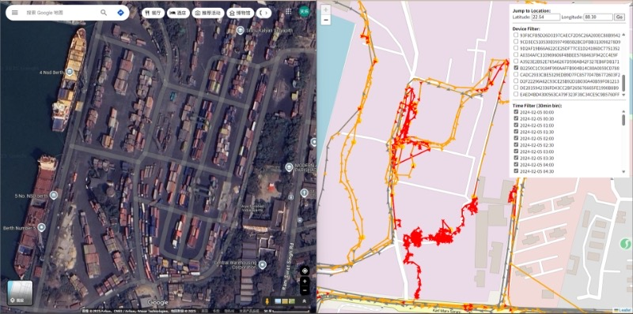

# Case Study
A comprehensive package for analyzing truck trajectory data, including dwell time detection and entry/exit pattern analysis in **Netaji Subhas Dock**. 
<div align="center">

  

</div>

## Project Structure

```
project/case study
├── Data/                           # Input data directory
│   └── [sample_data]
├── Output/                         # Output directory (auto-created)│ 
│   ├── dwell_map_per_day.html
│   └── [various visualization files]
├── assets/
│   └── [images]
├── vehicle_analyzer.py             # Main analysis class
├── config.py                       # Configuration parameters
├── run_analysis.py                 # Interactive script
├── streamlit_heatmap_app.py        # Streamlit web dashboard
├── run_streamlit.bat               # Windows launcher for dashboard
├── run_streamlit.sh                # Unix/Linux launcher for dashboard
└── README.md                       # This file
```

## Features

### 1. Data Preprocessing
- Filters vehicles that appear in the target analysis area
- Extracts complete trajectories for selected vehicles
- Handles data cleaning and validation

### 2. Dwell Time Analysis
- Uses DBSCAN clustering to identify stationary periods
- Calculates dwell duration for each cluster
- Generates heatmaps showing dwell patterns by hour and vehicle
- Creates interactive maps with color-coded dwell clusters

### 3. Entry/Exit Analysis
- Tracks vehicle transitions between different zones (in/near/far)
- Calculates transition durations
- Analyzes patterns by hour of day and weekday/weekend
- Generates comprehensive visualizations

### 4. Interactive Web Dashboard
- Real-time vehicle heatmap visualization using Streamlit
- Interactive filtering by device ID and time
- Multiple map layers (heatmap, stay points, trajectories)
- Color-coded stop duration analysis
- Manual map center control


## Installation

### Required Dependencies
```bash
pip install pandas numpy scikit-learn seaborn matplotlib folium geopy

# Additional packages for Streamlit dashboard
pip install streamlit streamlit-folium branca
```

### Files Needed
1. Place your GPS data file in the `case study/Data/` directory
2. Update `config.py` if using different file names or parameters

## Usage

### Option 1: Interactive Script
```bash
python run_analysis.py
```
This will show a menu with options to run different parts of the analysis.

### Option 2: Programmatic Usage
```python
from vehicle_analyzer import VehicleAnalyzer
import config

# Initialize analyzer
analyzer = VehicleAnalyzer(data_dir='Data', output_dir='Output')

# Run complete analysis
results = analyzer.run_full_analysis(input_file='your_data.csv')

# Or run individual components
subset_df = analyzer.preprocess_data()
dwell_results, pivot_table = analyzer.analyze_dwell_time()
entry_exit_results = analyzer.analyze_entry
```

### Interactive Web Dashboard
```bash
# Windows
run_streamlit.bat

# Unix/Linux/MacOS
chmod +x run_streamlit.sh
./run_streamlit.sh

# Or manually
python -m streamlit run streamlit_heatmap_app.py
```
This launches a web-based dashboard with interactive filtering and real-time visualization.
